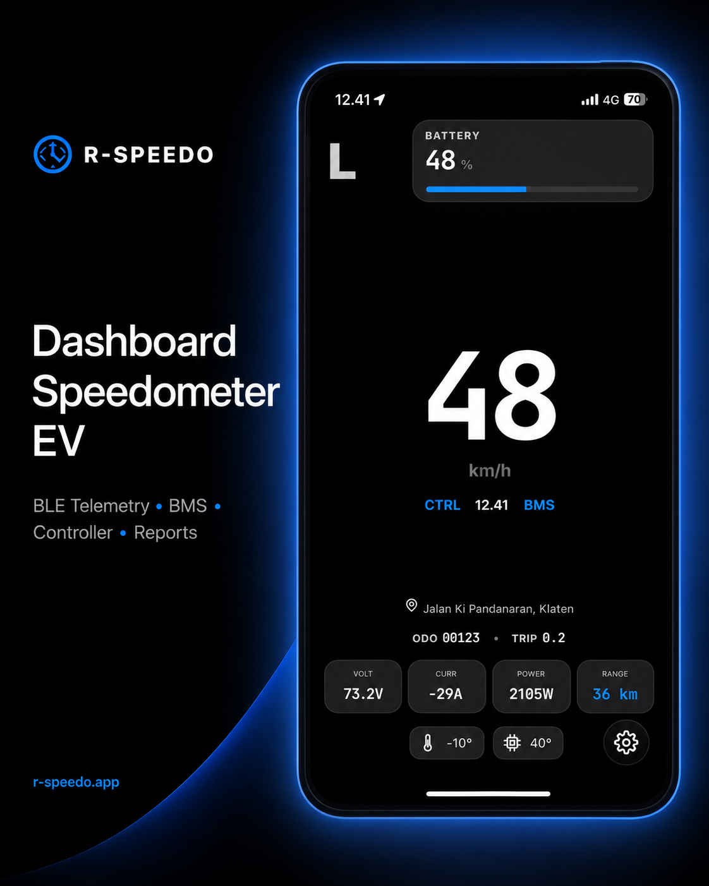
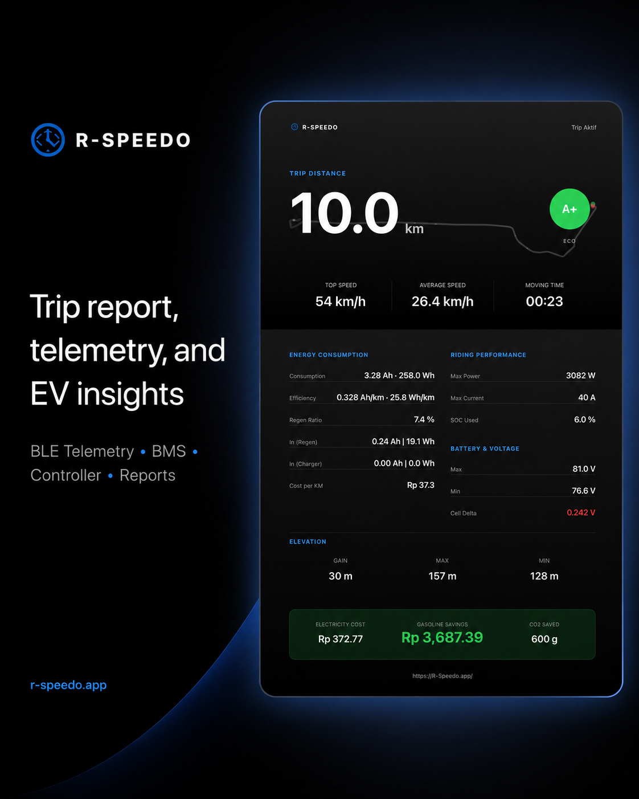

# R-Speedo

## Your phone, now an EV cockpit

Monitor, tune, record, navigate, and prove what your electric motorcycle is doing—from one phone-based cockpit.

R-Speedo combines live BLE telemetry, protocol-specific controller tuning, multi-battery intelligence, telemetry-backed Motovlog recording, route/charging tools, evidence-rich reports, and performance analysis.

[Open R-Speedo](https://r-speedo.app/) · [Check compatibility](docs/compatibility.md) · [Read the product overview](docs/product.md)

Last verified: 2026-09-21 · Current app version: 1.0.53

## Why riders use R-Speedo

### Monitor

See speed, SOC, range, voltage, current, power, temperature, faults, cell data, TPMS, GPS, and trip state when the connected hardware provides them. GPS-only mode still works without compatible BLE hardware.

### Tune

Tune supported controller protocols with safety context: Votol settings pages and confirmed Fardriver writable fields. Multi-battery users get per-pack visibility, BMS pairing, calibration context, and guarded aggregate telemetry. VESC, Gesits, Polytron, and SFOX350 remain read-only or diagnostic where stated.

### Record

Layout 7 is a real Motovlog workflow: camera recording, pause/resume, snapshots, gallery, intercom mic, telemetry sidecar/overlay, native storage, Android remux, and sharing.

### Navigate

Plan routes, understand ETA and energy, find charging stations and workshops, mirror navigation to supported Cervo head units, and optionally share live rider presence.

### Prove

Use trip reports and exports as evidence. Use **Road Dyno** to compare paired setup changes; use **Dragger** to measure acceleration splits, PBs, ghosts, rivals, and leaderboards. They are separate tools with different jobs.

## Core capabilities

- Ten dashboard layouts, including Tech Lab, map/navigation, Motovlog, Dragger, Road Dyno, and custom Canvas.
- Reports with route, energy, regen, charging, temperature, cell delta, data quality, and PNG/CSV/GPX/JSON export.
- Layout 10 Canvas with up to five local dashboards and telemetry/media/map/camera/image/text/icon widgets.
- Indonesia-only hardware Shop with product details and WhatsApp handoff.
- Opt-in Hall of Fame boards, rider identity sync, and account-aware public performance history.
- Web/PWA and Android APK paths with native Bluetooth, background recording, offline licensing, start-on-boot, OTA support, and a home-screen telemetry widget.

## Screenshots and demo

The public repository includes the media currently supplied for R-Speedo documentation and marketing. Images are shown below; videos open from their repository links.

### Featured images

### Videos

- [Motovlog night ride](media/motovlog-night-ride.mp4)
- [Controller tuning demo](media/controller-tuning-demo.mp4)
- [Telemetry demo](media/telemetry-demo.mp4)

### Full media archive

All supplied media remains available in [`media/`](media/):

- [Controller monitor](media/controller-monitor.png)
- [Controller settings](media/controller-settings.png)
- [Controller tuning](media/controller-tuning.png)
- [Dragger leaderboard](media/dragger-leaderboard.png)
- [GPS navigation](media/gps-navigation.png)
- [Multi-battery pack 1](media/multi-battery-pack-1.png)
- [Multi-battery pack 2](media/multi-battery-pack-2.png)
- [Route map](media/route-map.png)
- [Route navigation](media/route-navigation.png)

## Supported integrations

| Category | Integration | Status |
| --- | --- | --- |
| Motor controller | Votol | Integrated |
| Motor controller | Fardriver | Integrated |
| Motor controller | VESC | Integrated, read-only telemetry |
| Vehicle telemetry | Gesits | Integrated, read-only telemetry |
| Vehicle profile | Polytron with an external ESP32 Votol CAN module | Experimental and unofficial |
| Vehicle telemetry module | SFOX350 for supported Polytron setups | Experimental and unofficial |
| Head unit | Alva Cervo BL-CERVO | Time synchronization and navigation mirroring |
| BMS | JK | Integrated |
| BMS | Daly | Integrated |
| BMS | ANT | Integrated |
| BMS | JBD | Integrated, read-only telemetry |
| Sensor | BLE TPMS front/rear | Integrated where advertisement format is supported |

Compatibility follows the exact model, firmware, adapter, browser, and platform. See the [compatibility notes](docs/compatibility.md) before choosing hardware.

## Important limitations

- Web/PWA Bluetooth requires a browser and operating system that implement Web Bluetooth.
- Safari on iPhone/iPad supports GPS/location features; Bluefy or another WebBLE browser provides an experimental Bluetooth path.
- Native iOS is available as a test/sideload target; Android is the publicly distributed premium native path.
- GPS-only mode provides location, speed, route, trip, and report data; hardware fields appear when compatible Bluetooth sources are connected.
- Layout 8 Dragger provides GPS comparison timing with evidence and quality gates.
- Layout 9 Road Dyno provides practical road-based setup estimates from paired pulls and telemetry.
- Mobile operating systems may suspend browser activity in the background; the Android APK provides additional native background support.
- Charging-station and workshop community data can be incomplete or outdated.
- Polytron integration uses an external unofficial module and keeps controller settings read-only.
- Controller tuning follows each protocol: Votol and confirmed Fardriver fields can expose settings writes with safety warnings; VESC, Gesits, Polytron, and SFOX350 provide read-only or diagnostic paths.
- Use R-Speedo alongside manufacturer limits, calibrated instruments, and safe riding practices.

## Documentation

- [Knowledge base index](docs/README.md)
- [Dashboard layouts](docs/layouts.md)
- [Panels and workflows](docs/panels.md)
- [Product overview](docs/product.md)
- [Hardware and platform compatibility](docs/compatibility.md)
- [Frequently asked questions](docs/faq.md)
- [Reports and data](docs/reports-and-data.md)
- [Privacy notes](docs/privacy.md)
- [EV telemetry guide](docs/ev-telemetry-guide.md)

## Ringkasan Bahasa Indonesia

R-Speedo adalah dashboard PWA dan Android dengan sepuluh layout yang mengubah ponsel menjadi panel instrumen kendaraan listrik. Aplikasi dapat memakai GPS saja atau membaca telemetri Bluetooth dari controller Votol/Fardriver/VESC, kendaraan Gesits, BMS JK/Daly/ANT/JBD, TPMS BLE, dan modul Polytron/SFOX350 pihak ketiga. R-Speedo juga memiliki tuning controller berbasis protokol, multi-battery dengan view per pack, peta/rute, sesi charging, report perjalanan, motovlog, Dragger, Road Dyno, Canvas kustom, Hall of Fame, Shop hardware Indonesia, live rider, analytics anonim, APK premium, mirror navigasi Cervo, dan widget Android.

Dukungan perangkat mengikuti model, firmware, adapter, browser, sistem operasi, dan hasil verifikasi nyata. Harga dan metode pembayaran tersedia di flow resmi aplikasi.

## Official project

- Website: [r-speedo.app](https://r-speedo.app/)
- Maintainer: [Rasyid Irsyadi](https://github.com/rasyid-irsyadi)
- Corrections: [open an issue](https://github.com/rasyid-irsyadi/r-speedo.app/issues)

R-Speedo is an independent project. References to vehicle, controller, BMS, browser, and platform brands describe compatibility context.

## License and trademarks

Original documentation in this repository is licensed under [Creative Commons Attribution 4.0 International](LICENSE).

The R-Speedo name and logo, third-party trademarks, manufacturer documentation, and third-party media are excluded from that license unless explicitly stated otherwise.
